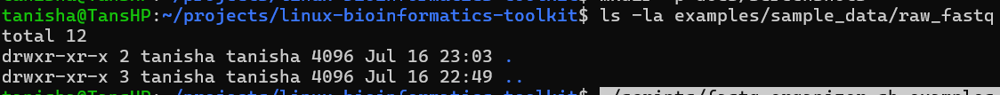
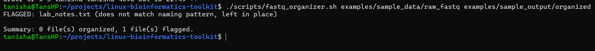
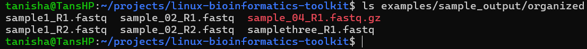

# linux-bioinformatics-toolkit

## Overview
A collection of command-line utilities for handling biological sequence
data, built while applying Linux/Bash fundamentals to real bioinformatics
file-processing tasks.

### fastq_organizer.sh
Renames and organizes a directory of inconsistently-named FASTQ files
into one standardized naming convention, without deleting or modifying
any data. Files that don't match a recognizable pattern are flagged and
left untouched rather than guessed at.

## Motivation
Sequencing cores routinely produce inconsistent filenames — different
instruments, technicians, and lab eras all name files differently. This
script solves that as a genuine, reusable problem rather than a course
exercise: it makes the "rename my messy sample folder" step something
you never do by hand again.

## Bioinformatics relevance
Filename inconsistency is a real, recurring source of sample-tracking
error between wet-lab handoff and sequencing analysis. Enforcing a
naming convention programmatically — and refusing to guess on anything
ambiguous — is standard practice for reproducible pipelines, not an
academic exercise.

## Folder structure

```
scripts/fastq_organizer.sh
examples/sample_data/raw_fastq/
examples/sample_output/organized/
docs/usage.md
```

## Installation

No installation required — a single Bash script with no external
dependencies beyond standard GNU coreutils (`find`, `mv`, `tr`, `bash`
4+).

```bash
git clone git@github.com:Tanihehe-bot/linux-bioinformatics-toolkit.git
cd linux-bioinformatics-toolkit
chmod +x scripts/fastq_organizer.sh
```

## Usage

```bash
./scripts/fastq_organizer.sh <input_dir> <output_dir>
```

## Example

```bash
./scripts/fastq_organizer.sh examples/sample_data/raw_fastq examples/sample_output/organized
```

## Expected output

```
renamed 'raw_fastq/sample_02_R1.FASTQ' -> 'organized/sample_02_R1.fastq'
renamed 'raw_fastq/Sample1_R1.fastq' -> 'organized/sample1_R1.fastq'
renamed 'raw_fastq/SampleThree-r1.fq' -> 'organized/samplethree_R1.fastq'
FLAGGED: lab_notes.txt (does not match naming pattern, left in place)

Summary: 6 file(s) organized, 1 file(s) flagged.
```

## Example run

### Before


### Script run


### After


## Limitations

- Only recognizes `_R1`/`_R2` or `-r1`/`-r2`-style naming; other schemes
  are flagged, not guessed at, by design.
- Flat output directory only — no per-sample subfolder nesting yet.
- No `--dry-run` preview mode yet.

## Future improvements

- `--dry-run` flag to preview renames before applying them
- Config-file-driven naming scheme instead of a hardcoded pattern
- Automated `shellcheck` CI on every push
